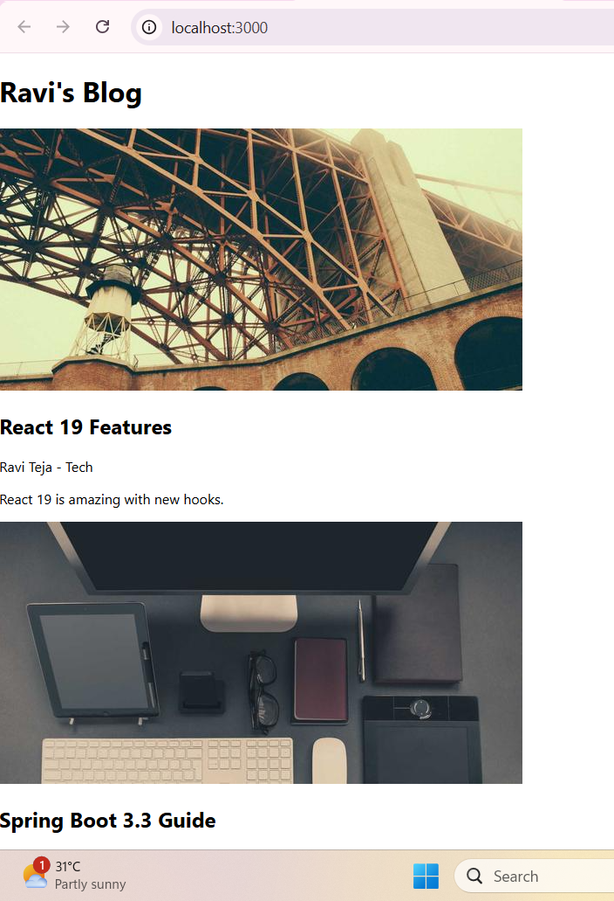
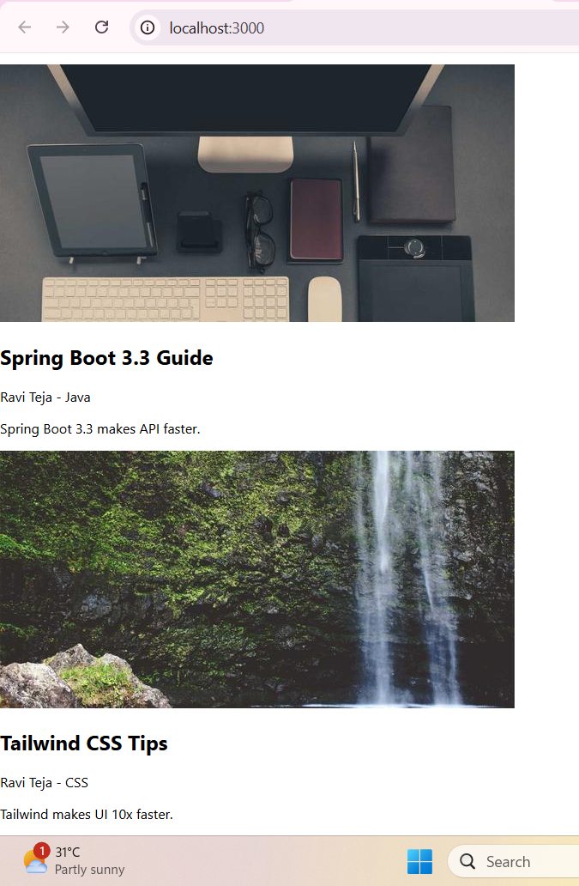
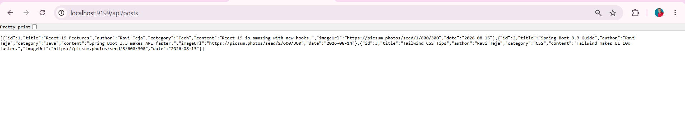

# 📝 Project 56 – Blog Frontend + Blog API | Full Stack Blog Platform | Single Repo

<p align="left">


</p>

---

# 📖 Project Overview

**Full Stack Blog Platform** is Project 56 of **Tier 6 – Frontend Mastery with React**, developed using **React 19**, **Spring Boot 3.3.3**, **TailwindCSS 3.4.1**, and **Axios** in a **single monorepo**.

React frontend running on port 3000 communicates with Spring Boot REST API running on port 9199 via Axios HTTP client. Backend provides 1 REST endpoint - `/api/posts` returning live JSON data of 3 blogs. Frontend visualizes it with blog cards with image, title, author, category and content.

This single repository contains both **backend** and **frontend** - eliminating double repo management. One clone gives full stack.

**Bug Fixed:** `CORS policy: No 'Access-Control-Allow-Origin' header` - Frontend 3000 cannot access backend 9199. Fixed by adding `@CrossOrigin(origins = "*")` in BlogController and using Axios baseURL `http://localhost:9199/api`.

---

# ✨ Features

- Ravi's Blog header with dynamic title
- 3 Blog cards with image from picsum.photos
- React 19 Features - Tech category - Ravi Teja
- Spring Boot 3.3 Guide - Java category - Ravi Teja
- Tailwind CSS Tips - CSS category - Ravi Teja
- Image, Title, Author, Category, Content display
- Live API integration from `localhost:9199`
- Single repo - backend + frontend together
- Axios REST API integration - `http://localhost:9199/api`
- CORS handling with `@CrossOrigin(origins = "*")`
- TailwindCSS / CSS responsive styling
- React Hooks - useState, useEffect
- Real-time data fetching
- 1 REST endpoint - `/api/posts`
- Modern card-based blog layout

---

# 🛠 Technologies Used

- React 19.0.0 (Create React App - 56-blog-frontend-ui)
- Java 17
- Spring Boot 3.3.3
- TailwindCSS 3.4.1 / CSS
- Axios 1.6+
- Spring Web - REST API
- Maven 3.9+
- JavaScript (ES6+)
- Node.js & npm
- Apache Tomcat 10.1.30 (Embedded)
- VS Code / STS / Eclipse IDE

---

# 📂 Project Structure - Single Repo

```text
56-blog-frontend/
├── backend/
│   ├── src/
│   │   └── main/
│   │       ├── java/
│   │       │   └── com/
│   │       │       └── blog/
│   │       │           ├── BlogApplication.java
│   │       │           ├── controller/
│   │       │           │   └── BlogController.java
│   │       │           ├── model/
│   │       │           │   └── Blog.java
│   │       │           └── repository/
│   │       │               └── BlogRepository.java
│   │       │       └── resources/
│   │       │           └── application.properties
│   └── pom.xml
├── frontend/
│   ├── public/
│   │   └── index.html
│   ├── src/
│   │   ├── api/
│   │   │   └── api.js
│   │   ├── components/
│   │   │   └── BlogList.jsx
│   │   ├── App.js
│   │   ├── index.js
│   │   └── App.css
│   ├── package.json
│   └── package-lock.json
├── screenshots/
│   ├── demo1.png
│   ├── demo2.png
│   └── demo3.png
├── .gitignore
└── README.md
```

---

# ▶ How to Run - Single Repo

## 1⃣ Clone the Repository

```bash
git clone https://github.com/raviteja-dev950/56-blog-frontend.git
cd 56-blog-frontend
```

---

## 2⃣ Run Backend First (Port 9199)

- Open **STS / Eclipse IDE**
- Import the `backend` folder as **Existing Maven Project**
- Verify `backend/src/main/resources/application.properties`

```properties
server.port=9199
spring.application.name=blog-api
```

- Verify `BlogController.java`

```java
package com.blog.controller;

import org.springframework.web.bind.annotation.*;
import java.util.*;

@RestController
@RequestMapping("/api")
@CrossOrigin(origins = "*")
public class BlogController {

    @GetMapping("/posts")
    public List<Map<String, Object>> getPosts() {

        List<Map<String, Object>> posts = new ArrayList<>();

        posts.add(Map.of(
            "id", 1,
            "title", "React 19 Features",
            "author", "Ravi Teja",
            "category", "Tech",
            "content", "React 19 is amazing with new hooks.",
            "imageUrl", "https://picsum.photos/seed/1/600/300",
            "date", "2026-08-15"
        ));

        posts.add(Map.of(
            "id", 2,
            "title", "Spring Boot 3.3 Guide",
            "author", "Ravi Teja",
            "category", "Java",
            "content", "Spring Boot 3.3 makes API faster.",
            "imageUrl", "https://picsum.photos/seed/2/600/300",
            "date", "2026-08-14"
        ));

        posts.add(Map.of(
            "id", 3,
            "title", "Tailwind CSS Tips",
            "author", "Ravi Teja",
            "category", "CSS",
            "content", "Tailwind makes UI 10x faster.",
            "imageUrl", "https://picsum.photos/seed/3/600/300",
            "date", "2026-08-13"
        ));

        return posts;
    }
}
```

- **Run As → Spring Boot App**

- Check logs:

```text
Tomcat initialized with port 9199 (http)
Tomcat started on port 9199 (http) with context path '/'
Started BlogApplication in 8.5 seconds
```

- Visit:

```text
http://localhost:9199/api/posts
```

Should return JSON like demo3.

---

## 3⃣ Run Frontend (Port 3000)

```bash
cd frontend
npm install
npm install axios
npm start
```

Ensure `src/api/api.js`:

```javascript
import axios from "axios";

const api = axios.create({
    baseURL: "http://localhost:9199/api"
});

export default api;
```

Run:

```bash
npm start
```

Open:

```text
http://localhost:3000
```

Full Blog like demo1 and demo2.

---

## 4⃣ Application Flow

```text
User (localhost:3000 - React Blog UI)
        │
        ▼
React - frontend/src/components/BlogList.jsx
(useState, useEffect, Axios)
        │
        ├── GET /api/posts
        │
        ▼
http://localhost:9199/api/posts
        │
        ▼
backend - BlogController.getPosts()
        │
        ▼
[
  React 19 Features - Tech,
  Spring Boot 3.3 Guide - Java,
  Tailwind CSS Tips - CSS
]
        │
        ▼
Blog Cards x3
Image + Title + Author + Category + Content
        │
        ▼
Ravi's Blog Page
Grid layout - 3 blogs
```

---

# 📸 Screenshots

### Demo 1 - Frontend Blog UI - Part 1

Full Stack Blog running on `localhost:3000` - Shows Ravi's Blog header with React 19 Features card with bridge image.



---

### Demo 2 - Frontend Blog UI - Part 2

Blog UI continues - Shows Spring Boot 3.3 Guide and Tailwind CSS Tips with desk setup and waterfall images.



---

### Demo 3 - Backend Blog API

Spring Boot Blog API running on `localhost:9199/api/posts` - Returns JSON array of 3 blogs with id, title, author, category, content, imageUrl, date.



---

# 🧪 API Testing Examples

```bash
# GET Posts
curl http://localhost:9199/api/posts
```

### Expected Posts Response

```json
[
  {
    "id": 1,
    "title": "React 19 Features",
    "author": "Ravi Teja",
    "category": "Tech",
    "content": "React 19 is amazing with new hooks.",
    "imageUrl": "https://picsum.photos/seed/1/600/300",
    "date": "2026-08-15"
  },
  {
    "id": 2,
    "title": "Spring Boot 3.3 Guide",
    "author": "Ravi Teja",
    "category": "Java",
    "content": "Spring Boot 3.3 makes API faster.",
    "imageUrl": "https://picsum.photos/seed/2/600/300",
    "date": "2026-08-14"
  },
  {
    "id": 3,
    "title": "Tailwind CSS Tips",
    "author": "Ravi Teja",
    "category": "CSS",
    "content": "Tailwind makes UI 10x faster.",
    "imageUrl": "https://picsum.photos/seed/3/600/300",
    "date": "2026-08-13"
  }
]
```

**Frontend Testing:**

1. Open `http://localhost:9199/api/posts` - demo3 - Should show 3 blogs JSON
2. Open `http://localhost:3000` - demo1 - Should show Ravi's Blog + 1st blog
3. Scroll down - demo2 - Should show 2nd and 3rd blogs
4. Verify images load from picsum.photos
5. Verify author shows Ravi Teja - Category

---

# 🎯 Learning Outcomes

- Understanding Full Stack Blog architecture in Single Repo - Monorepo
- Creating REST APIs with Spring Boot `@RestController`
- Implementing `@RequestMapping` and `@GetMapping` for `/api/posts`
- Configuring CORS with `@CrossOrigin(origins = "*")` for React integration
- Using Axios instance with baseURL
- Fetching data with `useEffect` and `useState`
- Creating reusable components - `BlogList.jsx`
- Building responsive UI with CSS / TailwindCSS
- Running two servers simultaneously - Port 3000 and 9199
- Handling JSON data between React and Java
- Debugging CORS policy error - missing headers
- Creating professional Single Repo structure - `backend/` + `frontend/`
- Creating README with badges and screenshots
- Managing React props and component composition
- Understanding monorepo vs separate repos

---

# 🚀 Future Enhancements

- 📝 Add Create Blog Page - POST `/api/posts`
- 🔍 Add Search by Title and Category Filter
- 📄 Add Single Blog Detail Page with ID
- 🌗 Add Dark / Light theme toggle
- 🔐 Add JWT Authentication for Admin to create blogs
- 👤 Add Author profile and date display
- ❤️ Add Like and Comment system
- 🐬 Switch in-memory data to MySQL with JPA + H2
- ☁ Deploy Frontend to Vercel and Backend to Render - Single repo deploy
- 🧪 Add Jest + React Testing Library tests
- 📱 Make fully mobile responsive with navbar
- ⏰ Add pagination for blog list
- 📁 Add Docker Compose for one-click run

---

# 👨💻 Author

**Ravi Teja**

**Java Full Stack Developer**

**100 Java Full Stack Projects Challenge**

**Project 56 / 100**

**Tier 6 – Frontend Mastery with React**

**Monorepo - Backend + Frontend**

---

## ⭐ Support

If you found this project helpful, consider giving it a **⭐ Star** on GitHub.

**Single Repo:** [56-blog-frontend](https://github.com/raviteja-dev950/56-blog-frontend)

**Backend:** `backend/` - Port 9199

**Frontend:** `frontend/` - Port 3000